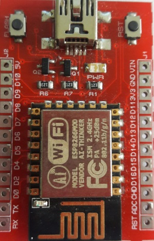

EspSoftwareSerial

Implementación de la librería serial de software Arduino para el ESP8266

La misma funcionalidad que la biblioteca AVR correspondiente, pero varias instancias pueden estar activas al mismo tiempo. Se admite una velocidad de hasta 115200 baudios. El constructor también tiene un tamaño de búfer de entrada opcional.

Tenga en cuenta que debido al hecho de que el ESP siempre tiene otras actividades en curso, habrá alguna inexactitud en los tiempos de interrupción. Esto puede conducir a errores de bits cuando se tiene un tráfico de datos pesado en altas velocidades de transmisión.

